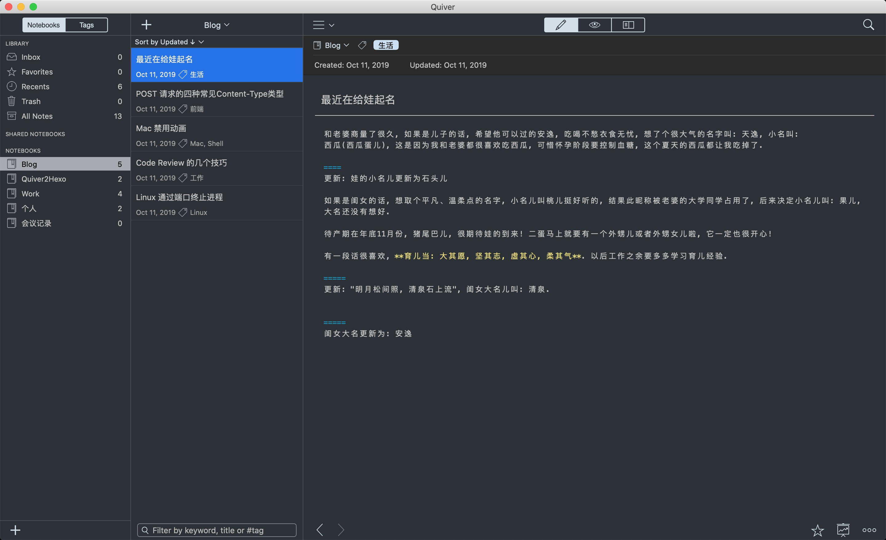
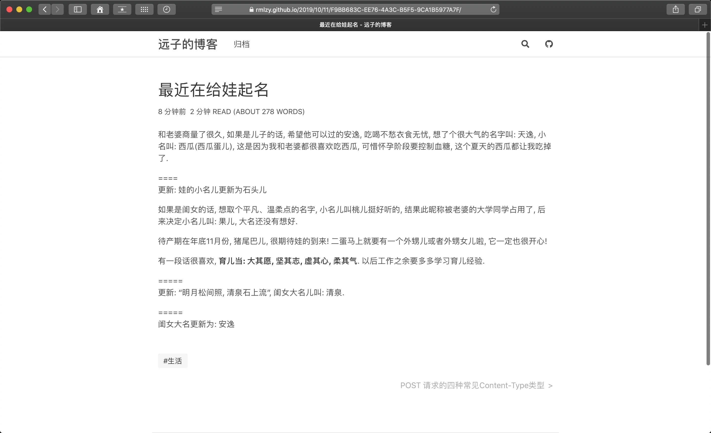

Write in Quiver, deploy to Hexo blog.

## How to use

```bash
pip3 install html2text progress

# Step 1: specify your quiver notebook path at quiver2hexo.py#10
# Step 2: specify your Hexo source path at quiver2hexo.py#12
# Step 3: run quiver2hexo.py
python3 quiver2hexo.py
```

Output:

```
➜  quiver2hexo (master) ✗ python3 quiver2hexo.py
Migration start Quiver2Hexo...

Processing:  |################                | 1/2

Migration success! 👌
```

## Preview

[Live Demo](https://rmlzy.github.io/)




