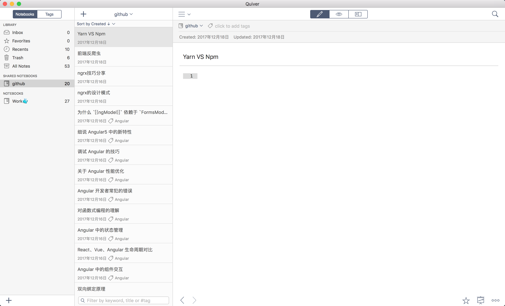
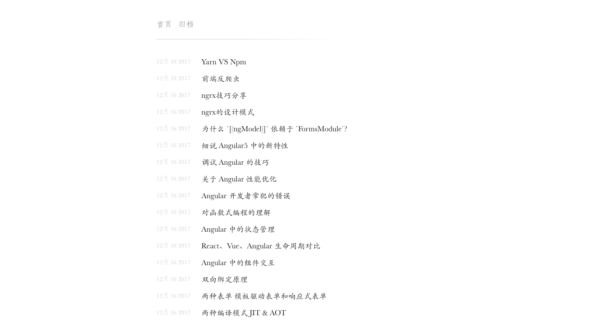

导出 quiver 笔记到 hexo.

## Quiver - 程序员专用笔记本
[点击下载Mac版](./assets/Quiver.app.zip).

## 如何使用

```bash
# 下载代码
git clone git@github.com:liuzhiyuan1993/quiver2hexo.git

# 安装依赖
cd quiver2hexo
npm install

# 启动脚本
node quiver2hexo.js quiver_qvnotebook_path hexo_source_path
```

参数说明:

+ `quiver_qvnotebook_path`: 笔记本的路径, 在 Quiver 中创建一个笔记本, 在 `设置` -> `Sync` -> `Library Location` 选项中可以看到笔记本的路径;
+ `hexo_source_path`: hexo `source` 文件夹的路径;

注意: **脚本会清空 `hexo_path/source/_post` 文件夹, 请事先备份**.

示例脚本: `deploy.sh`.

## 预览



